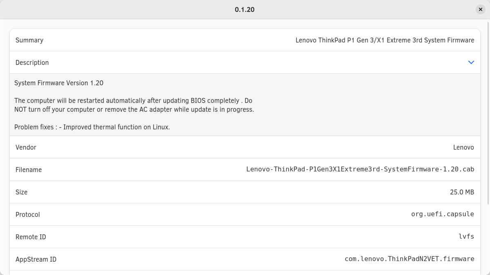

GNOME Firmware
==============

This application can:
* Upgrade, Downgrade, & Reinstall firmware on devices supported by fwupd.
* Unlock locked fwupd devices
* Verify firmware on supported devices
* Display all releases for a fwupd device

Screenshots:

Packaging status
----------------

* [Fedora](https://apps.fedoraproject.org/packages/gnome-firmware): `sudo dnf install gnome-firmware`
* [openSUSE](https://software.opensuse.org/package/gnome-firmware): `sudo zypper install gnome-firmware`

Build
-----

GNOME Firmware uses the [Meson](https://mesonbuild.com/) build system together with [Ninja](https://ninja-build.org/).

In order to build, go to the project root directory, run `meson build_dir_name`, where `build_dir_name` is the name of the directory meson will create to store build files.

After that, navigate to the newly created build directory and run `ninja`.

This will create an executable located in the `src` folder of the build dir. named `gnome-firmware`.

Please note, it's sufficient to run `meson` only once. You can find a list of dependencies below:

### Fedora
`sudo dnf install meson ninja-build fwupd-devel gtk3-devel help2man libhandy-devel`
